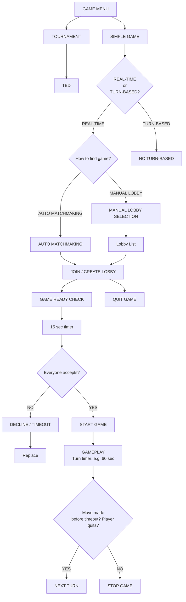

# Game & Lobby Flow

Notes: 
- Game speed
- Player reputation
- Player rating
- Disallow user from creating/joining more than one game
- Friends system for manual lobby

```mermaid
flowchart TD
    A[GAME MENU] --> B[SIMPLE GAME]
    A --> C[TOURNAMENT]

    C --> C1[TBD]

    B --> D{REAL-TIME<br/>or<br/>TURN-BASED?}

    D -->|REAL-TIME| E{How to find game?}
    D -->|TURN-BASED| D1[NO TURN-BASED]

    E -->|AUTO MATCHMAKING| F[AUTO MATCHMAKING]
    E -->|MANUAL LOBBY| G[MANUAL LOBBY SELECTION]

    G --> H[Lobby List]

    F --> I[JOIN / CREATE LOBBY]
    H --> I

    I --> J1[GAME READY CHECK]
    I --> J2[QUIT GAME]
    J1 --> K[15 sec timer]

    K --> L{Everyone accepts?}

    L -->|YES| M[START GAME]
    L -->|NO| N[DECLINE / TIMEOUT]

    N --> O[Replace]

    M --> P[GAMEPLAY<br/>Turn timer: e.g. 60 sec]

    P --> Q{Move made<br/>before timeout? Player quits?}

    Q -->|YES| R[NEXT TURN]
    Q -->|NO| S[STOP GAME]
```